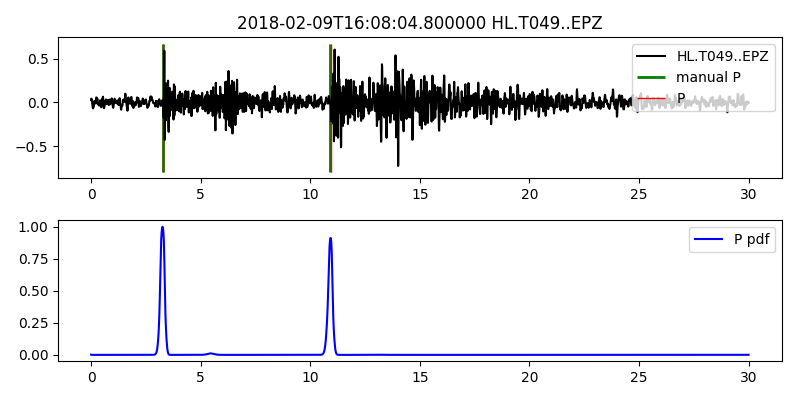

# SeisNN

Seismic event P phase picking project

Main framework: Obspy, Seisan, Tensorflow with Keras, Pytorch

Using U-net to generate pick probability

---

Early access

The code is still in the development state, API will change frequently. 

Please star us for upcoming updates!

---

Prerequisite:

- S-File catalog from [SEISAN](http://seisan.info/)
- SeisComP Data Structure (SDS) database. The directory and file layout of SDS is defined as:

      SDSROOT/YEAR/NET/STA/CHAN.TYPE/NET.STA.LOC.CHAN.TYPE.YEAR.DAY

Installation:

- pip install seisnn
- Clone this repository
- Follow the instructions in the [Docker](docker) folder to create a Docker container.
- SSH into the Docker container you create.

In the [scripts](scripts) folder:
 
- [generate_dataset.py](scripts/generate_dataset.py)
  - Make S-Files into training .pkl datasets.
- [evalution.py](seisnn/qc.py)
  - Calculate precision, recall and F1 score.
  - Plot error distribution.
- [plot_instance.py](scripts/plot_instance.py)
  - Plot the wavefile, picks and the probability form the .pkl dataset.
- [scanning.py](scripts/scanning.py)
  - Scan through all stations available in the given time window, transfer into .pkl dataset.
  
Training:

You can choose between [scripts/tensorflow](scripts/tensorflow) or [scripts/pytorch](scripts/pytorch)

- [pre_training.py](scripts/tensorflow/pre_training.py)
  - Pre-train the model using small dataset.
- [training.py](scripts/tensorflow/training.py)
  - Train the model with the pre-trained weight.
- [prediction.py](scripts/tensorflow/prediction.py)
  - Predict the probability of the picks and write into the dataset.

Model:

The model is stored in [seisnn/tensorflow](seisnn/tensorflow) or [seisnn/pytorch](seisnn/pytorch) 

- Nest_Net
  - Unet++ code modified from [MrGiovanni](https://github.com/MrGiovanni/Nested-UNet/blob/master/model_logic.py)

---

Reference:

 [PhaseNet](https://arxiv.org/abs/1803.03211)
 
 Zhu, W., & Beroza, G. C. (2018). PhaseNet: A Deep-Neural-Network-Based Seismic Arrival Time Picking Method. arXiv preprint arXiv:1803.03211.
 
 [U-net](https://lmb.informatik.uni-freiburg.de/people/ronneber/u-net/)
 
 Ronneberger, O., Fischer, P., & Brox, T. (2015, October). U-net: Convolutional networks for biomedical image segmentation. In International Conference on Medical image computing and computer-assisted intervention (pp. 234-241). Springer, Cham.
 
 [U-net ++](https://doi.org/10.1007/978-3-030-00889-5_1)
  
 Zhou, Z., Siddiquee, M. M. R., Tajbakhsh, N., & Liang, J. (2018). Unet++: A nested u-net architecture for medical image segmentation. In Deep Learning in Medical Image Analysis and Multimodal Learning for Clinical Decision Support (pp. 3-11). Springer, Cham.
 

---

[Jimmy Lab wordpress](https://jimmylab.wordpress.com/)
 

