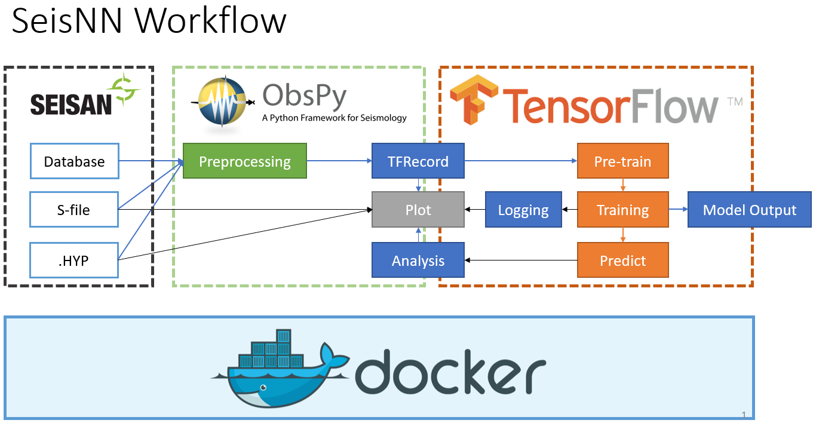

# SeisNN  

  

Docs build:   

Github Pages: https://seisnn.github.io/SeisNN/

Seismic event P phase picking project

Main framework: Obspy, Seisan, Tensorflow with Keras

Using U-net to generate pick probability

---

# Warning 

This version is unstable. Do not use it now.

The code is still in the development state, API will change frequently. 

Please star us for upcoming updates!

---

Prerequisite:

- S-File catalog from [SEISAN](http://seisan.info/)
- SeisComP Data Structure (SDS) database. The directory and file layout of SDS is defined as:

      SDSROOT/YEAR/NET/STA/CHAN.TYPE/NET.STA.LOC.CHAN.TYPE.YEAR.DAY

Installation:

- Follow the instructions in the [Docker](docker) folder to create a Docker container.
- SSH into the Docker container you create.

      ssh username@localhost -p49154

- Copy `/SeisNN/jupyter.sh` to your workspace and execute to start jupyter lab server

      cp /SeisNN/jupyter.sh ~/.
      chmod 777 jupyter.sh
      ./jupyter.sh

- Copy `/SeisNN/notebook` to your workspace

      cp -r /SeisNN/notebook ~/.

- Paste the URL with generate token into your local browser

      http://127.0.0.1:8888/?token=36b31a373a9d18cc9b30a50883ad5a3638b19bed47be8074
      
- Go through [notebook/00_initialize.ipynb](notebook/00_initialize.ipynb) to generate [config.yaml](config.yaml)

---

In the [notebook](notebook) folder:

[00_initialize](notebook/00_initialize.ipynb)

[01_load_database](notebook/01_load_sql_database.ipynb)

---

Reference:

 [PhaseNet](https://doi.org/10.1093/gji/ggy423) | [Github](https://github.com/wayneweiqiang/PhaseNet)

 Zhu, W., & Beroza, G. C. (2018). PhaseNet: A Deep-Neural-Network-Based Seismic Arrival Time Picking Method. arXiv preprint arXiv:1803.03211.

 [U-net](https://lmb.informatik.uni-freiburg.de/people/ronneber/u-net/)

 Ronneberger, O., Fischer, P., & Brox, T. (2015, October). U-net: Convolutional networks for biomedical image segmentation. In International Conference on Medical image computing and computer-assisted intervention (pp. 234-241). Springer, Cham.

 [U-net ++](https://doi.org/10.1007/978-3-030-00889-5_1) | [Github](https://github.com/MrGiovanni/UNetPlusPlus)

 Zhou, Z., Siddiquee, M. M. R., Tajbakhsh, N., & Liang, J. (2018). Unet++: A nested u-net architecture for medical image segmentation. In Deep Learning in Medical Image Analysis and Multimodal Learning for Clinical Decision Support (pp. 3-11). Springer, Cham.

---

Personal Blog (Traditional Chinese only):

[Jimmy Lab wordpress](https://jimmylab.wordpress.com/)