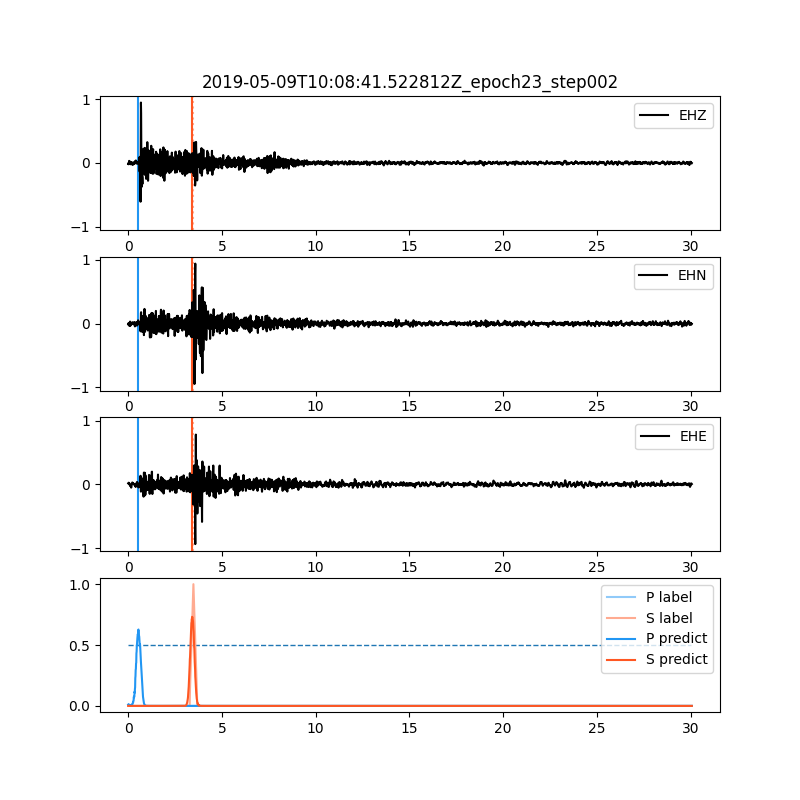

# SeisBlue  

 

Github Pages: https://seisblue.github.io/seisblue/

A deep-learning data processing platform for seismology

---

# Warning

The code is still in the development state, API will change frequently. 

Beta version will be released soon.

Please star us for upcoming updates!

---

Prerequisite:

- S-File catalog from [SEISAN](http://seisan.info/)
- SeisComP Data Structure (SDS) database. The directory and file layout of SDS is defined as:

      SDSROOT/YEAR/NET/STA/CHAN.TYPE/NET.STA.LOC.CHAN.TYPE.YEAR.DAY

Installation:

- Follow the instructions in the [Docker](docker) folder to create a Docker container.

---

Reference:
 
 [EQTansfomer](https://www.nature.com/articles/s41467-020-17591-w) | [Github](https://github.com/smousavi05/EQTransformer)

 Mousavi, S. M., Ellsworth, W. L., Zhu, W., Chuang, L. Y., & Beroza, G. C. (2020). Earthquake transformer—an attentive deep-learning model for simultaneous earthquake detection and phase picking. Nature communications, 11(1), 1-12.

 [PhaseNet](https://doi.org/10.1093/gji/ggy423) | [Github](https://github.com/wayneweiqiang/PhaseNet)

 Zhu, W., & Beroza, G. C. (2018). PhaseNet: A Deep-Neural-Network-Based Seismic Arrival Time Picking Method. arXiv preprint arXiv:1803.03211.

 [U-net](https://lmb.informatik.uni-freiburg.de/people/ronneber/u-net/)

 Ronneberger, O., Fischer, P., & Brox, T. (2015, October). U-net: Convolutional networks for biomedical image segmentation. In International Conference on Medical image computing and computer-assisted intervention (pp. 234-241). Springer, Cham.

 [U-net ++](https://doi.org/10.1007/978-3-030-00889-5_1) | [Github](https://github.com/MrGiovanni/UNetPlusPlus)

 Zhou, Z., Siddiquee, M. M. R., Tajbakhsh, N., & Liang, J. (2018). Unet++: A nested u-net architecture for medical image segmentation. In Deep Learning in Medical Image Analysis and Multimodal Learning for Clinical Decision Support (pp. 3-11). Springer, Cham.

 [PhasePApy](https://doi.org/10.1785/0220160019) | [GitHub](https://github.com/austinholland/PhasePApy)

 Chen, C., & Holland, A. A. (2016). PhasePApy: A robust pure Python package for automatic identification of seismic phases. Seismological Research Letters, 87(6), 1384-1396.

 [PyAPA](https://doi.org/10.3319/TAO.2018.12.23.01) | [GitHub](https://github.com/SeanMica/PyAPA)

 Chang, Y. H., Hung, S. H., & Chen, Y. L. (2019). A fast algorithm for automatic phase picker and event location: Application to the 2018 Hualien earthquake sequences. Terr. Atmos. Ocean. Sci, 30, 435-448.

---

Personal Blog (Traditional Chinese only):

[Jimmy Lab wordpress](https://jimmylab.wordpress.com/)