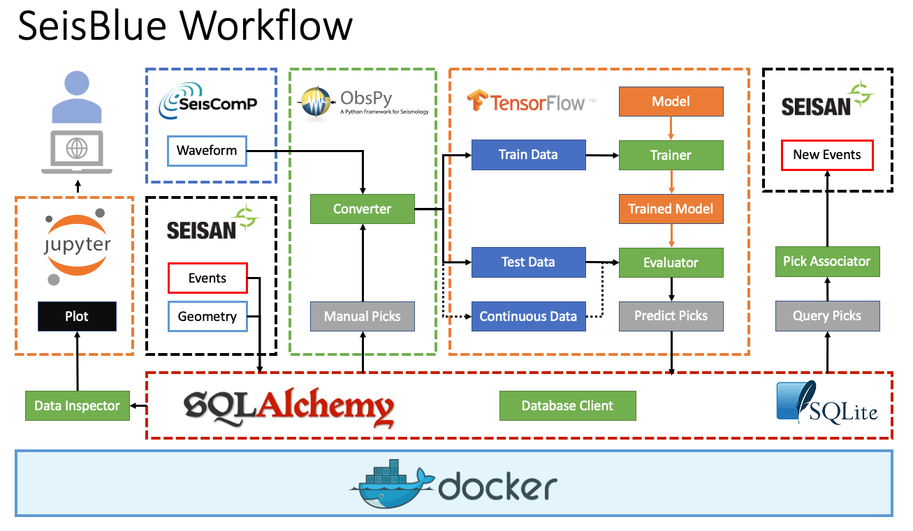

# SeisNN 

 

Seismic event P phase picking project

Main framework: Obspy, Seisan, Tensorflow with Keras

Using U-net to generate pick probability

---

# Warning 

This version is unstable. Do not use it now.

The code is still in the development state, API will change frequently. 

Please star us for upcoming updates!

---

Prerequisite:

- S-File catalog from [SEISAN](http://seisan.info/)
- SeisComP Data Structure (SDS) database. The directory and file layout of SDS is defined as:

      SDSROOT/YEAR/NET/STA/CHAN.TYPE/NET.STA.LOC.CHAN.TYPE.YEAR.DAY

Installation:

- Follow the instructions in the [Docker](docker) folder to create a Docker container.
- SSH into the Docker container you create.
- Clone this repo in the home folder.

      cd ~
      git clone https://github.com/jimmy60504/SeisNN.git

- Run  [config.py](config.py) to generate [config.yaml](config.yaml)

      python config.py

---

In the [scripts](scripts) folder:

Preprocessing:

- Turn catalog and trace into training set

Training:

- Pre-train
- Training
- Predict 

Analysis:

- SNR distribution
- Model evaluation

Visualization:

- Plot picking instances
- Plot map view
- Plot training history

Prototypes:

- Experimental functions

---

Reference:

 [PhaseNet](https://arxiv.org/abs/1803.03211) | [Github](https://github.com/wayneweiqiang/PhaseNet)

 Zhu, W., & Beroza, G. C. (2018). PhaseNet: A Deep-Neural-Network-Based Seismic Arrival Time Picking Method. arXiv preprint arXiv:1803.03211.

 [U-net](https://lmb.informatik.uni-freiburg.de/people/ronneber/u-net/)

 Ronneberger, O., Fischer, P., & Brox, T. (2015, October). U-net: Convolutional networks for biomedical image segmentation. In International Conference on Medical image computing and computer-assisted intervention (pp. 234-241). Springer, Cham.

 [U-net ++](https://doi.org/10.1007/978-3-030-00889-5_1) | [Github](https://github.com/MrGiovanni/UNetPlusPlus)

 Zhou, Z., Siddiquee, M. M. R., Tajbakhsh, N., & Liang, J. (2018). Unet++: A nested u-net architecture for medical image segmentation. In Deep Learning in Medical Image Analysis and Multimodal Learning for Clinical Decision Support (pp. 3-11). Springer, Cham.

---

Personal Blog (Traditional Chinese only):

[Jimmy Lab wordpress](https://jimmylab.wordpress.com/)